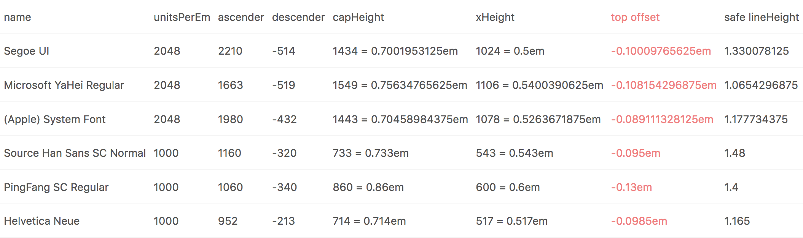
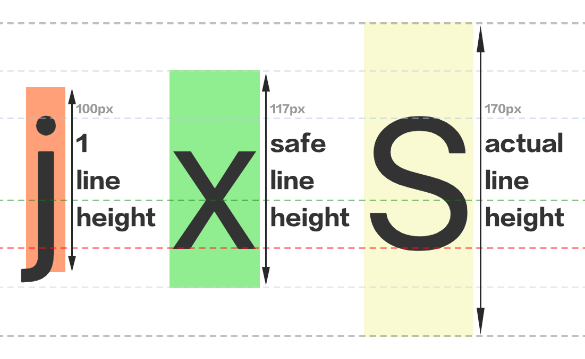

关于对齐的常见问题：

1.  浏览器本身如何对齐图标和文本？
2.  如何封装一个图标组件，使其无论大小如何变化，都能自动对齐临近的文本？
3.  为什么明明使用了 flex，图标还是看起来差了 1 像素没对齐？

---

有两种让浏览器自行对齐的方式（[CodePen demo：浏览器对齐](http://link.zhihu.com/?target=https%3A//codepen.io/ambarli/pen/vWLova%3Feditors%3D0010)）：

**一、 flex container**

```js
<button style={{display: 'inline-flex', alignItems: 'center'}}>
  <Icons.Heart />
  Like
</button>
```

缺陷：需要创建 flex 容器来包裹图标和文本，而不是仅仅通过修改图标的样式。

**二、 vertical-align middle**

```js
<button>
  <Icons.Heart style={{verticalAlign: 'middle'}} />
  <span style={{verticalAlign: 'middle'}}>Like</span>
</button>
```

缺陷：需要创建额外标签将文本包裹起来，并且文本偏移了 baseline（将影响上下间距和相邻元素的对齐）。

---

虽然上面的方式达到了对齐效果，但浏览器本身如何决定图标放置，参照什么来放置？

可以先从字体特征与 CSS `vertical-align` 开始探索：


图 1：vertical-align

简要说明：

* 最左侧是一个已对齐的图标，尺寸为 1.2em
* 最右侧文字标注了横向参考线，除 `cap-line` 外都是 `vertical-align` 的可选值
* `vertical-align` 作用于文本和非文本（如图片元素）效果不同，以应用 `vertical-align: baseline` 样式为例：

* 同一行内不同字体类型、字体大小或不同行高的文本对齐在相同 baseline 上
* 同一行内不同尺寸的图片底边对齐在 baseline 上

* `xHeight` 为小写字母 x 的高度（CSS 有 `ex` 单位表示它，`1ex` 约为 `0.5em` 左右 ）， `vertical-align: middle` 的定义就是它的一半高度，因此仅仅对图片应用 `vertical-align: middle`样式图片会看起来太靠下
* `capHeight` 为大写字母高度（CSS/JS 均无法获取，多数字体约为 `0.7em`）

## 近似对齐：放置在 cap-line 与 baseline 中间

从图 1 的直接猜测是把图片对齐在大写字母中间，即在 baseline 往上移动 `capHeight` 的一半。

这种对齐有两种实现方式（[CodePen demo：Cap 对齐](http://link.zhihu.com/?target=https%3A//codepen.io/ambarli/pen/NwNKwN%3Feditors%3D0010)）：

**一、从 baseline 开始偏移**

默认，图标底边贴在 baseline 上，先移动图标自身 50% 使图标中间对齐 baseline，然后上移`capHeight`的一半。

```css
/* 计算公式：capHeight / 2 / unitsPerEm ≈ 0.35em */

.center {
  vertical-align: baseline;
  transform: translateY(calc(50% - 0.35em));
}

/* 或者将 `capHeight` 可能成变量，动态获取 */
/* translateY(calc(50% - var(—capHeight, .35em))) */
```

缺陷：添加 CSS 动画会因占用了属性而冲突。

**二、**从 **middle-line 开始偏移**

图标中央就在 middle-line 上，因此先下移`xHeight`的一半，再上移`capHeight`的一半。

```js
/*
// 计算公式
top
  = (xHeight/2 - capHeight/2) / unitsPerEm
  ≈ .5em/2 - .7em/2
  ≈ -.1em

// 或复用 ex 单位来计算
top
  = 1ex/2 - capHeight/2 / unitsPerEm
  ≈ calc(0.5ex - 0.35em)
*/

// JSX
<button>
  <Icons.Heart
    style={{
      verticalAlign: 'middle',
      position: 'relative',
      top: '-.1em',
    }}
  />
  Like
</button>
```

无论选择哪种偏移方式，偏移值都会根据当前字体不同而有细微差异，见下图的高亮列：



图 2：Font Metrics

## 精确对齐：对齐定高文本

「精确」指达到与浏览器自行对齐相同的效果。需求来自问题 2，如何封装一个图标组件，仅通过修改图标本身来对齐相邻文本。



图 3：三种 line-height

这个图很有趣，内联元素在不同条件下产生了不同的边界（颜色填充区域），简要说明（[CodePen demo：浏览器本身如何对齐](http://link.zhihu.com/?target=https%3A//codepen.io/ambarli/pen/bYpbvp%3Feditors%3D0010)）：

* `j` 表示基础的 `line-height`，也就是 `1em` 高，等同于当前的 `font-size` 100px，当 inline-block 元素（也可以是 inline-flex item）设置为 `line-height: 1` 时可以得到它。值得注意 `j` 的边界不在任何参考线上。此图也能说明不要误用这个值，有可能（如应用 overflow 样式）内容溢出导致截断。
* `x` 表示安全的 `line-height`，是 inline 元素默认的高度（也是 `text-top` 到 `text-bottom` 的距离）。也可以由图 2 中的 `(ascender + descender) / unitsPerEm` 计算得到（当前字体对应表格中第三行的值，1.1777）。
* `S` 表示实际的 `line-height` ，是 inline-block 或 inline-flex 元素默认高度（也是`top` 到 `bottom` 的距离）。当设置父容器 `line-height: 1.7` 时，实际 `line-height` 将是 `100px * 1.7 = 170px`。

有了上面的图例，精确对齐思路可以借鉴 CSS 规范中的 [strut](http://link.zhihu.com/?target=https%3A//www.w3.org/TR/CSS22/visudet.html%23strut) 概念，创建一个局部的容器，生成不可见文本（零宽空格，模拟 strut），让不可见文本对齐 line-box 中其他文本，让图标对齐这个不可见文本：

> On a [block container element](http://link.zhihu.com/?target=https%3A//www.w3.org/TR/CSS22/visuren.html%23block-boxes) whose content is composed of [inline-level](http://link.zhihu.com/?target=https%3A//www.w3.org/TR/CSS22/visuren.html%23inline-level) elements, 'line-height' specifies the _minimal_ height of line boxes within the element. The minimum height consists of a minimum height above the baseline and a minimum depth below it, exactly as if each line box starts with a zero-width inline box with the element's font and line height properties[.](https://zhuanlan.zhihu.com/p/30624268/edit) We call that imaginary box a "strut."

局部容器的高度可以是上图 `S` 的高度（inline-flex 居中），也可以跟随图标的高度（图标绝对定位，保持与容器位置相同），也可以固定（图标绝对定位居中，但缺陷是不能太大超过行高）。

精确对齐的两种实现方式（[CodePen demo：模拟浏览器对齐](http://link.zhihu.com/?target=https%3A//codepen.io/ambarli/pen/NwNPpo%3Feditors%3D0010)）：

**一、`inline-block`** **hack**

```js
const MyIcon = ({width, height}) => (
  <span
    style={{
      position: 'relative',
      display: 'inline-block',
      lineHeight: height, // 使文本高度为图标高度
      width, // 占住横向空间
    }}
  >
    {'\u200b' /* ZWSP(zero-width space) */}
    <svg width={width} style={{position: 'absolute', left: 0, top: 0}} />
  </span>
)
```

对齐效果完美。

**二、`inline-flex`** **hack（推荐）**

```js
const MyIcon = props => (
  <span
    style={{
      display: 'inline-flex',
      alignItems: 'center',
    }}
  >
    {'\u200b' /* ZWSP(zero-width space) */}
    <svg {...props} />
  </span>
)
```

对齐效果完美（不支持过时的浏览器 [caniuse.com/flex](http://link.zhihu.com/?target=http%3A//caniuse.com/%23search%3Dflex)）。

---

## 为什么明明使用了 flex，图标还是看起来差了 1 像素没对齐？

图标与文本的对齐误差取决于 `iconSize`、`fontSize` 和 `lineHeight` 之间奇偶关系（不同浏览器表现可能不同，[CodePen demo: 奇偶对齐](http://link.zhihu.com/?target=https%3A//codepen.io/ambarli/pen/ZaWJQg%3Feditors%3D0010)）：

| iconSize         | fontSize | lineHeight                                                     |
| ---------------- | -------- | -------------------------------------------------------------- |
| 奇数             | 偶数     | 奇偶改变不影响图标对齐                                         |
| 偶数             | 奇数     | 奇偶改变不影响图标对齐                                         |
| 偶数             | 偶数     | 偶数对齐，奇数偏上 1px                                         |
| 奇数             | 奇数     | 奇数对齐，偶数偏上 1px                                         |
| 小数（.2/.5/.8） | 奇数     | 奇偶改变不影响图标对齐，都上偏 1px（偶数时图标纵向拉伸了 1px） |
| 小数（.2/.5/.8） | 偶数     | 偶数对齐，奇数偏上 1px（偶数时图标纵向拉伸了 1px）             |

👆 测试环境：字体 PingFang SC，浏览器 Chrome，对齐 Flex。

## 相关

* [How to Align - a Collection on CodePen](http://link.zhihu.com/?target=https%3A//codepen.io/collection/XjyabO/) 所有示例列表
* [md.icons](http://link.zhihu.com/?target=http%3A//ambar.li/reiconify/md.icons/) 自动生成的全套 Material icons，添加了方便的对齐参数
* [W3C: Visual Formatting Model](http://link.zhihu.com/?target=https%3A//www.w3.org/TR/CSS22/visuren.html%23inline-formatting) 了解规范如何定义内联行为和行高计算
* [Deep dive CSS: font metrics, line-height and vertical-align](http://link.zhihu.com/?target=http%3A//iamvdo.me/en/blog/css-font-metrics-line-height-and-vertical-align) 感谢作者的精彩图解
* [blink-diff](http://link.zhihu.com/?target=https%3A//github.com/yahoo/blink-diff) 用工具需要对比生成的对齐效果，而不是用肉眼
* [什么是字体?](http://link.zhihu.com/?target=http%3A//designwithfontforge.com/zh-CN/What_Is_a_Font.html) 了解 unitsPerEm/ascender/descender 等概念
* [opentype.js](http://link.zhihu.com/?target=https%3A//opentype.js.org/font-inspector.html)、[FontForge](http://link.zhihu.com/?target=https%3A//fontforge.github.io/) 查询 font metrics

## 附

图标转 React 组件工具，集成了本文提到的对齐属性（`center`）：[reiconify​](http://link.zhihu.com/?target=https%3A//github.com/ambar/reiconify)
