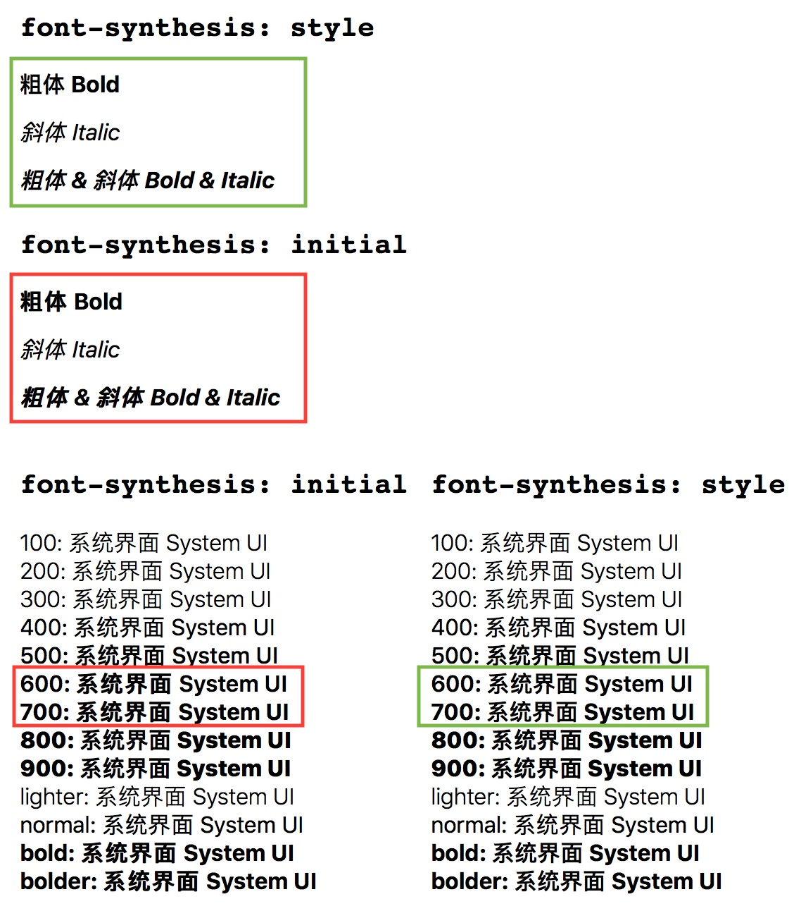
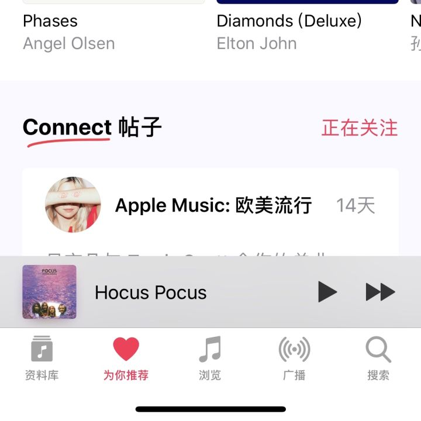

如何重现：[Code Pen 样例页面](https://link.zhihu.com/?target=https%3A//codepen.io/ambarli/full/XzgYeP/)（使用最新版 iOS/macOS Safari 访问）

解决方式：

```css
font-synthesis: style;
```

样例截图：



macOS High Sierra 10.13.1 - Safari

说明：

* 重现版本为 iOS 11.1.1，macOS High Sierra 10.13.1，条件为使用 `-apple-system` 指定字体（即同时使用苹方与 San Francisco）
* 红色的方框内被加粗的**中文**是「伪粗体」，在字重为 **600/700** 时触发
* 绿色的方框内是应用样式修复后的结果
* `font-synthesis: initial`相当于 `font-synthesis: weight style`，因此不能使用 `font-synthesis: none` ，否则会影响斜体（font-style）的合成
* 高 DPI 设备（iPhone X）问题不太明显
* WebKit 一个月前修复了这个问题（[r223589](https://link.zhihu.com/?target=https%3A//trac.webkit.org/changeset/223589/webkit)，此文的修复方法就是参考了它的回归测试代码），<del>但什么时候能发布不确定</del> 己在 Safari Technology Preview 11.1（WebKit 13605.1.13.2）中确认被修复

---

关于字体样式的补充：

* 为了与原生界面的字体一致，web 页面会按「system-ui, fallback names, generic name」顺序指定字体，如：`font-family: -apple-system, BlinkMacSystemFont, ..., sans-serif`
* 根据截图也可以看出，苹方没有 Bold 字重（只有 Semibold，600），而 San Francisco 有 Bold 字重，会导致 CSS 使用 bold（700）指定字重时，中西文粗体不均衡（中文回退到 600），使用 500 或 600 会达到最佳效果
* Android 中文使用思源黑体，但由于字重缺失，需要使用 700 达到加粗效果；西文有点值得注意，lang 属性会影响字体选择（[CodePen demo: lang & Noto Sans & Roboto](https://link.zhihu.com/?target=https%3A//codepen.io/ambarli/pen/XzaEPr)），zh 会应用思源黑体，en 会应用 Roboto

根据上述限制，推荐在项目中使用 mixin 实现粗体：

```css
/* postcss-mixins 的例子 */
@define-mixin bold {
  /* 也可以只应用在 iOS/macOS 上 */
  font-weight: 600;
  font-synthesis: style;

  html[data-android] & {
    font-weight: 700;
  }
}

.title {
  @mixin bold;
}
```

---

当中英文同时出现而字重不一的例子，来自 iOS 官方应用：

音乐: 

App Store: 
